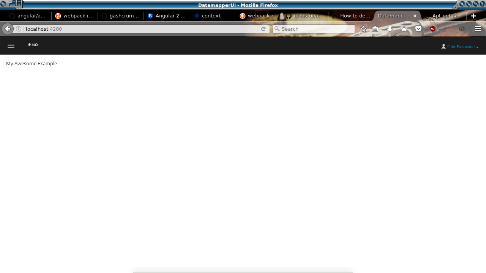

# DatamapperUI Component Library



This project was generated with [angular-cli](https://github.com/angular/angular-cli) version 1.0.0-beta.24.  It differs from a normal angular-cli project in that it's a library and meant to be used as a component in other consoles.  However it still contains a demo app that can be used for standalone development of this component.

Code that should be shared out of the library should go under `lib` and exported via `lib/index.ts`.  Note that shared components etc. should be also be marked for export in your NgModule, i.e.:

```
@NgModule({
  declarations: [
    MyAwesomeTotallyPrivateThing,
    MyAwesomeSharedThing
  ],
  exports: [
    MyAwesomeSharedThing
  ]
})
export class MySharedModule {

}
```

## Development server for standalone development
Run `ng serve` for a dev server. Navigate to `http://localhost:4200/`. The app will automatically reload if you change any of the source files.

## Code scaffolding
Run `ng generate component component-name` to generate a new component. You can also use `ng generate directive/pipe/service/class/module`.

Note that generated code will wind up under `dev-app`, hopefully at some point `ng generate` will support a custom output directory, until then just move/copy the generated code to an appropriate location under `lib`

## Running unit tests
Run `ng test` to execute the unit tests via [Karma](https://karma-runner.github.io).

## Running end-to-end tests
Run `ng e2e` to execute the end-to-end tests via [Protractor](http://www.protractortest.org/).
Before running the tests make sure you are serving the app via `ng serve`.

## Deploying to Github Pages
Run `ng github-pages:deploy` to deploy to Github Pages.

## Further help
To get more help on the `angular-cli` use `ng help` or go check out the [Angular-CLI README](https://github.com/angular/angular-cli/blob/master/README.md).
